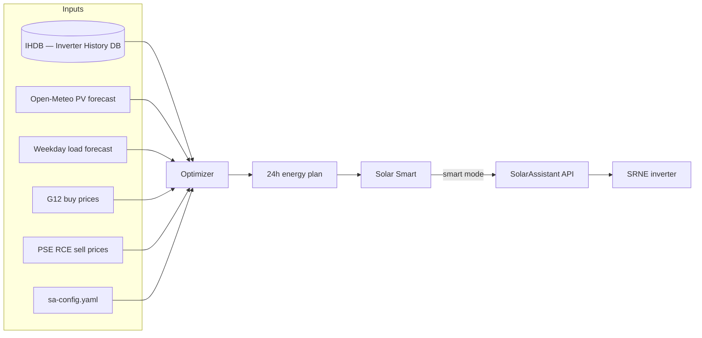

# Solar Smart — energy arbitrage for SRNE via SolarAssistant

**Solar Smart** is a Raspberry Pi web app for **energy arbitrage** planning and optional automation of an **SRNE** hybrid inverter through the [SolarAssistant](https://solarassistant.com/) REST API. It reads live metrics and **inverter history (IHDB — Inverter History DB)**, builds a cost-aware plan for today and tomorrow, and — with Smart mode on — programs the inverter timer through SolarAssistant.

Runs alongside SolarAssistant on its own web port. Tested with **SRNE 3-phase** and a **G12** two-zone buy tariff.

**topics:** `srne` `solarassistant` `energy-arbitrage` `inverter` `ihdb` `grafana` `home-assistant` `scheduler` `optimizer`

## Screenshots

| Dashboard — live PV / battery / grid flow | Rules — SRNE timer & inverter settings | Rules — rolling energy arbitrage plan |
|---|---|---|
|  |  |  |

## How it works



1. **Every 15 minutes** the app updates the **energy plan** for today and tomorrow using live consumption, battery level, weather, and electricity prices.
2. The **optimizer** chooses when to buy from the grid, charge the battery, or sell to the grid so that your **G12 bill** is as low as possible — within safe battery limits.
3. With **Smart mode** on, at the **start of each hour** the app programs the inverter timer in SolarAssistant; it also keeps work mode in sync with the plan.
4. SolarAssistant applies those settings on the SRNE.

## Features

- Live dashboard: PV, load, battery, grid, energy overview
- Hourly energy accruals and charts from **IHDB**
- PV forecast (Open-Meteo) and RCE sell prices
- **Power Management** — scale PV and consumption forecast totals up to 2 days ahead; see [Power Management overrides](#power-management-overrides)
- **EV Charging** — plan day and night charge windows up to 2 days ahead; see [EV charging](#ev-charging)
- **Energy arbitrage plan** — rolling view of today and tomorrow: planned actions, grid import/export, battery SOC, and estimated costs
- **Monthly history** — closed months from **IHDB**; day-by-day import, export, energy and service cost; **Energy Deposit Total** — see [Monthly history and energy deposit](#monthly-history-and-energy-deposit)
- **Timer schedule** — view and edit SRNE charge/discharge slots in the UI; with Smart mode on, the Pi applies the plan automatically

## Smart energy planning

Solar Smart does not talk to the inverter directly. It builds a cost-aware plan and, when Smart mode is on, sends charge/discharge windows to SolarAssistant.

### Keeping the plan up to date

The plan is refreshed **every 15 minutes** and again overnight for the next days’ forecasts:

- **Already finished hours** stay as they were — based on real **IHDB** measurements.
- **The current hour** — the planned action and timer for that hour are fixed when the hour starts; only measured PV, load, and SOC catch up as the hour progresses.
- **Later today and tomorrow** — replanned whenever prices, weather, or consumption outlook change.

You always see a single rolling picture: what happened, what is happening now, and what the optimizer suggests next.

### What the optimizer optimises

It looks at PV and load, G12 buy prices, PSE RCE sell prices, and battery limits, then schedules grid import, battery charge, and export to **reduce what you pay Energa** — cheaper imports, export when RCE is worthwhile, enough charge left for the night and the next sunny hours.

The **Energy arbitrage** table in Rules shows the result hour by hour.

### Monthly history and energy deposit

The **Monthly history** tab summarises **closed calendar months** from **IHDB** measurements:

- daily production, import, export, and costs;
- **Energy Cost** and **Service Cost** per day and month;
- per-day **Energy Cost Total (Deposit)** — how much export credit that day added to the pool, after paying that day’s grid import from older credits.

**Energy Deposit Total** at the top of the tab is the **running balance of your net-billing export credits** in PLN:

- **Export** to the grid earns credit at **RCE** prices and adds to the pool.
- **Grid import** is settled against the pool first — the energy part of what you bought is paid from accumulated export credit, not from your pocket, until the pool runs out.
- Credits **carry across months** — surplus export from one month can offset import energy in later months.

The deposit models how Energa net-billing works in the app: export and import energy are not simply netted on one line; import draws down the credit pool you built up from export. **Service Cost** on import is separate and is not paid from this pool.

Use monthly history to see whether arbitrage is working in practice and how the deposit balance grows or shrinks over time.

### Power Management overrides

In the dashboard **Power Management** panel, scale PV and consumption forecast totals up to 2 days ahead relative to the baseline forecast. Changes are saved to config, applied to the day cache, and reflected in the energy arbitrage plan.

Each night the app clears these overrides so the next day starts from fresh forecasts.

### EV charging

In the dashboard **EV Charging** panel, plan **day** and **night** charge windows (time range and power) up to 2 days ahead. Enabled windows add extra consumption to the load forecast and energy plan.

Past EV sessions are excluded when building the weekday load profile from historical data.

### How it controls the inverter (Smart mode)

When Smart mode is on, the Pi updates SolarAssistant from the plan:

| Planned action | Effect |
|----------------|--------|
| **Charging from Grid** | Timed grid charge in the planned window |
| **Discharging to Grid and Load** | Timed discharge and grid export in the planned window |
| **Other** | No timed charge/discharge |

At the **start of each hour** the timer for that hour is written to the inverter. The app also sets the correct **work mode** so SRNE behaviour matches the plan.

### What you get as a user

- **Visibility** — live status, buy vs sell prices, the rolling plan, and monthly totals in one place.
- **Optional automation** — Smart mode in Rules lets the Pi program the inverter from the plan.
- **Accountability** — compare plan vs reality and track how your **energy deposit** balance changes month by month.

**Energy arbitrage cost columns** in the hourly plan and monthly history:

| Column | Meaning |
|--------|---------|
| **G12 zone / buy price** | Peak or off-peak zone and full G12 buy rate (PLN/kWh brutto) for that hour |
| **RCE price** | PSE day-ahead price as export credit under net-billing — **brutto PLN/kWh** |
| **Energy Cost** | Net **energy (obrót)** balance: import at the G12 energy component minus export credited at RCE. Positive in the UI means export credit exceeds energy import. |
| **Service Cost** | **Distribution and other non-energy fees** on grid import — the part of G12 brutto above the energy component. Charged only on imported kWh; not offset by export. |

Export settles against the energy side at **RCE brutto**, on the same VAT basis as G12 buy prices.

The optimizer shifts consumption, battery use, and grid export to **improve the energy balance** and **cut service cost**. Monthly history rolls this up per day and month.

Smart mode is **off by default** — the plan and monthly history work without writing anything to the inverter.

## Minimal configuration

Copy `sa-config.yaml.example` to `sa-config.yaml` and set at least site location, battery size, SA password, and G12 prices:

```yaml
location:
  latitude: 52.0
  longitude: 21.0

solar:
  azimuth: 180
  blocks:
    - { power_kwp: 5.0, tilt: 30 }

inverter:
  ac_capacity_kw: 5.0

battery:
  capacity_kwh: 10.0
  max_charge_power_kw: 6.0      # SA timer charge power (kW DC)
  max_discharge_power_kw: 5.0   # SA timer discharge power (kW DC)

simulation:
  min_soc_pct: 15

grid:
  g12:
    tariff_name: "G12"
    peak_price_pln_kwh: 1.0
    offpeak_price_pln_kwh: 0.5

sa:
  host: "localhost"
  password: "YOUR_SA_WEB_PASSWORD"
```

See `sa-config.yaml.example` for EV charging, loss factors, load profile, and SA metric topic overrides.

## Examples / Usage

### 1. Install on Pi and open the UI

```bash
git clone <repository-url>
cd solar-assistant
cp sa-config.yaml.example sa-config.yaml
# edit sa-config.yaml — sa.password and your site
bash install.sh
```

Open `http://<pi-ip>:8000/rules` — **Energy arbitrage** shows the plan; **Timer Schedule** mirrors what SolarAssistant reports.

### 2. Enable Smart mode

**UI:** Rules → Timer Schedule → toggle **Smart mode**.

**API:**

```bash
curl -X POST http://<pi-ip>:8000/api/smart-mode \
  -H "Content-Type: application/json" \
  -d '{"enabled": true}'
```

On enable, Solar Smart runs an immediate sync. The plan then refreshes every 15 minutes; the inverter timer is updated at the start of each hour when Smart mode stays on.

## Requirements

- Raspberry Pi with SolarAssistant installed and **IHDB** on the Pi
- Python 3.11+
- SRNE inverter exposed through SolarAssistant discovery API
- SA web password configured in SolarAssistant

## Service management (Pi)

Solar Smart: `http://<pi-ip>:8000/`

Service management:

```bash
sudo systemctl status smart
bash scripts/reload-smart.sh
```

## Deploy updates from Windows

```powershell
.\sync-to-pi.ps1
```

`sa-config.yaml` on the Pi is **not** overwritten by deploy.

## Local development (Windows)

```powershell
py -m venv .venv
.\.venv\Scripts\pip install -r requirements.txt
copy sa-config.yaml.example sa-config.yaml
copy sa-config.local.yaml.example sa-config.local.yaml
# Edit sa-config.yaml (same as Pi) and sa.password; local overlay sets sa.host to Pi IP

.\scripts\run-local.ps1
```

Uses `sa-config.yaml` plus optional `sa-config.local.yaml` overlay and an SSH tunnel to Pi **IHDB**.

## Configuration

| File | Purpose |
|------|---------|
| `sa-config.yaml` | Main site config (gitignored; same file on Pi and Windows) |
| `sa-config.yaml.example` | Template for new installs |
| `sa-config.local.yaml` | Optional Windows overlay merged at load |

Key flags in config:

- `debug_tab_enabled` — show Debug tab in UI

## License

MIT — see [LICENSE](LICENSE).
