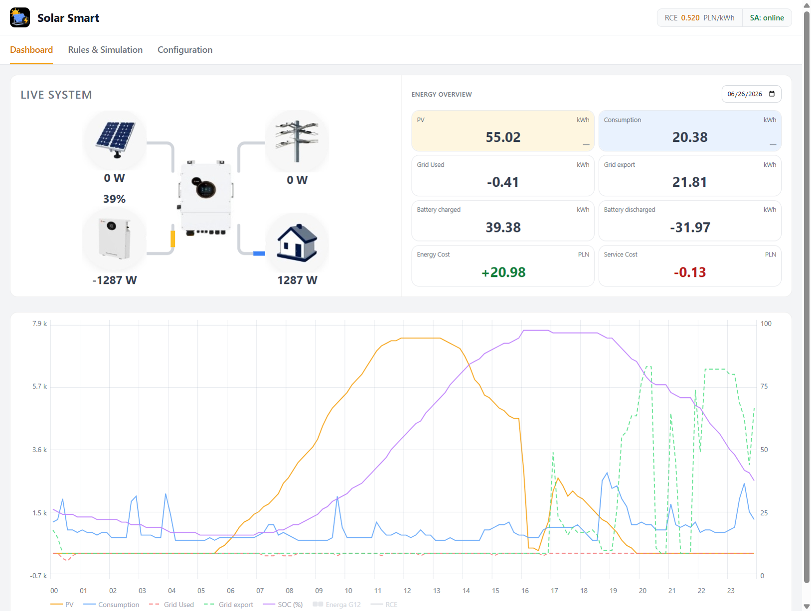
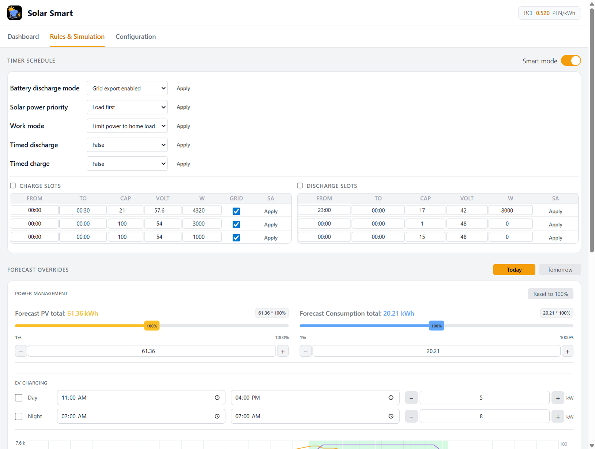
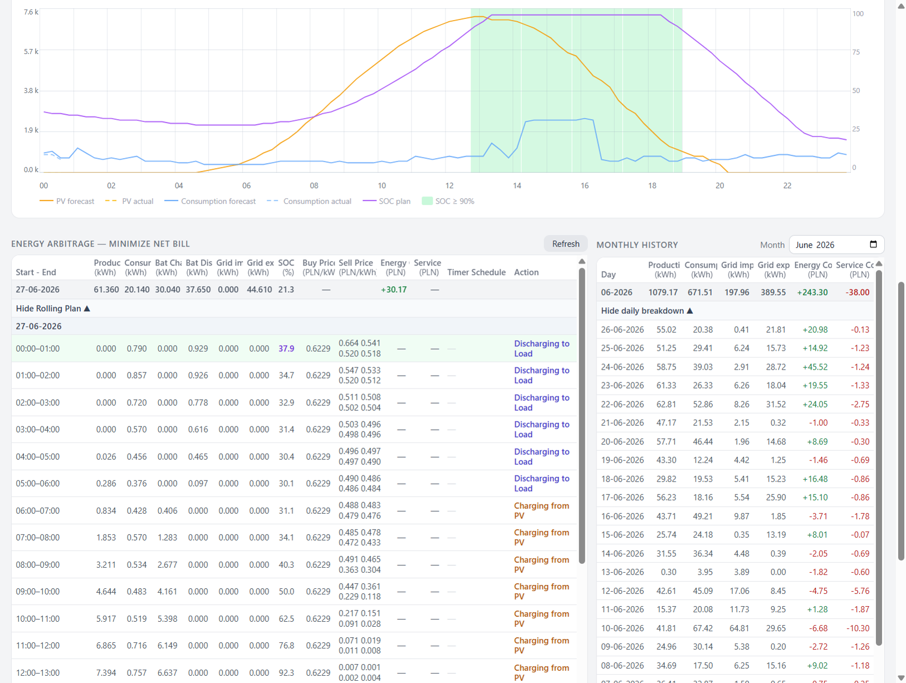
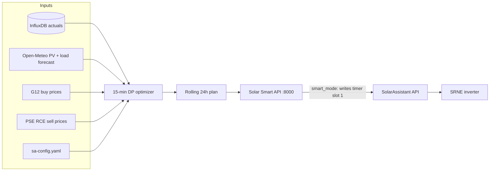

# Solar Smart — energy arbitrage for SRNE via SolarAssistant

**Solar Smart** is a Raspberry Pi web app for **energy arbitrage** planning and optional automation of an **SRNE** hybrid inverter through the [SolarAssistant](https://solarassistant.com/) REST API. It reads live metrics and InfluxDB history, runs a 15-minute **optimizer**, and — when Smart mode is on — **writes timer slot 1** (charge or discharge window) to SolarAssistant each hour.

Runs alongside SolarAssistant (port **80**) on port **8000**. Tested with **SRNE 3-phase** and Energa **G12** tariff (Poland).

**Suggested GitHub topics:** `srne` `solarassistant` `energy-arbitrage` `inverter` `influxdb` `grafana` `home-assistant` `scheduler` `optimizer`

## Screenshots

| Dashboard — live PV / battery / grid flow | Rules — SRNE timer & inverter settings | Rules — rolling energy arbitrage plan |
|---|---|---|
|  |  |  |

## How it works



1. **Every hour at :00 (Europe/Warsaw)** the backend rebuilds a 24-hour plan (even when Smart mode is off).
2. The **optimizer** (`plan_optimizer.py`) minimises net electricity cost: `grid import × G12 buy − grid export × export credit`, with SOC floor and night reserve.
3. With **`smart_mode_enabled: true`**, the next clock hour is translated into SA timer fields and pushed to SolarAssistant.
4. SolarAssistant applies the **Timer Schedule** on the SRNE.

## Features

- Live dashboard: PV, load, battery, grid, energy overview
- Hourly energy accruals and charts (InfluxDB)
- PV forecast (Open-Meteo) and RCE sell prices
- **Power Management** — scale today's and tomorrow's PV and consumption forecast totals (% of Open-Meteo baseline); changes feed into the energy arbitrage plan
- **EV Charging** — plan day and night charge windows (time range and kW) for today or tomorrow; extra load is included in the consumption forecast and plan
- **Energy arbitrage simulation and monthly cost history** — rolling 24-hour plan that minimises your G12 electricity bill; hourly table with planned actions, import/export, and cash balance; closed-month totals from Influx actuals
- **Timer schedule read/write through SolarAssistant REST API** — view and edit the SRNE timed charge/discharge slots in the UI; with Smart mode on, the backend writes slot 1 automatically each hour

## Smart energy planning

Solar Smart does not talk to the inverter directly. It plans energy flows and, when enabled, programs the **Timer Schedule** that SolarAssistant already exposes for SRNE hybrid inverters.

### What the algorithm does

Every hour at **:00 Europe/Warsaw** the app rebuilds a **Plan Simulation** (this runs even when Smart mode is off):

1. **Inputs** — live battery SOC and today's completed hours from InfluxDB; PV/load forecast for today and tomorrow (Open-Meteo + weekday load cache); Energa **G12** buy prices (peak/off-peak zones); **PSE RCE** quarter-hourly sell prices; battery capacity, timer DC power limits, and transfer losses from config.
2. **Optimizer** — a 15-minute dynamic-programming model (`plan_optimizer.py`) steps through the next 24 hours and picks, for each quarter, whether to import from the grid, charge the battery from the grid, or export stored energy to the grid. The objective is to minimise net cash cost: `grid import × G12 buy − grid export × export credit`. Battery export is allowed only when RCE is high enough to beat keeping energy for self-consumption at off-peak buy price. A SOC floor (`min_soc_pct`) and night reserve prevent over-discharging before the next PV window.
3. **Output in the UI** — the **Energy arbitrage** tab shows the rolling plan hour by hour (action label, PV, load, grid flows, SOC, energy and service cost). Completed hours are reconciled against Influx actuals. **Monthly history** aggregates past days the same way.

At **23:59 Europe/Warsaw** a nightly job rebuilds weekday Load + Open-Meteo PV profiles for tomorrow and the day after, then estimates tomorrow's energy gap (PV − load − usable SOC). If the house needs more energy than PV can cover, it stores a suggested grid-charge rate (`_charge_rate_kw`) used when the plan calls for **Charging from Grid**.

### How it controls the inverter

When `smart_mode_enabled: true` in config, the same hourly **:00** job extracts the **next clock hour** from the plan and writes it to SolarAssistant via REST:

| Planned action | Inverter effect |
|----------------|-----------------|
| **Charging from Grid** | Timer **charge** slot 1 for the next hour (from/to, power, target SOC); `grid_charge` switch ON; charge current limit set from planned kW |
| **Discharging to Grid and Load** | Timer **discharge** slot 1 for the next hour (power, stop at `min_soc_pct`) |
| Other (idle, PV to load, discharge to load only) | Slot 1 cleared — inverter follows normal on-grid behaviour |

Slots **2 and 3** on the inverter are left unchanged (merged with the live SA schedule). Manual edits in the **Rules** tab still work; **Sync hour** triggers the same write immediately.

SolarAssistant applies the timer rules on the SRNE; Solar Smart only sets the schedule and grid-charge permission — work mode and other SA settings stay under your control.

### What you get as a user

- **Visibility** — one place to see live status, buy vs sell prices (G12 + RCE chart), and a cost-aware plan for the rest of today and tomorrow.
- **Optional automation** — flip `smart_mode_enabled` to let the Pi push the next-hour charge or discharge window without opening the SA UI each hour.
- **Accountability** — planned vs actual rows and monthly totals so you can see whether arbitrage decisions matched reality and what they cost.

Smart mode is **off by default**; the plan table and charts work without writing anything to the inverter.

## Minimal configuration

Copy `sa-config.yaml.example` to `sa-config.yaml` and set at least site location, battery size, SA password, and G12 prices:

```yaml
smart_mode_enabled: false   # set true to auto-write timer slot 1 each hour

location:
  latitude: 54.50
  longitude: 18.50

solar:
  azimuth: 187
  blocks:
    - { power_kwp: 5.0, tilt: 25 }

inverter:
  ac_capacity_kw: 8.0

battery:
  capacity_kwh: 43.0
  max_charge_power_kw: 5.0      # SA timer charge power (kW DC)
  max_discharge_power_kw: 8.0   # SA timer discharge power (kW DC)

simulation:
  min_soc_pct: 15

grid:
  g12:
    tariff_name: "Energa G12"
    peak_price_pln_kwh: 1.2444
    offpeak_price_pln_kwh: 0.6229

sa:
  host: "localhost"
  password: "YOUR_SA_WEB_PASSWORD"
```

See `sa-config.yaml.example` for EV charging, loss factors, load profile, and SA metric topic overrides.

## Example plan output

`GET /api/simulation` returns the rolling 24-hour plan (one row per clock hour). Truncated example:

```json
{
  "rows": [
    {
      "hour": 12,
      "start": "27-06-2026 13:00",
      "production": 7.37,
      "consumption": 0.76,
      "grid_import": 0.0,
      "grid_export": 0.0,
      "soc": 93.1,
      "action": "Charging from PV",
      "g12_zone": "offpeak",
      "buy_price": 0.6229,
      "rce_price": 0.0037,
      "energy_cost": 0.0,
      "timer_schedule": ""
    },
    {
      "hour": 18,
      "start": "27-06-2026 19:00",
      "action": "Discharging to Grid and Load",
      "grid_export": 4.2,
      "export_credit": 0.664,
      "timer_schedule": "Dis 18:00-19:00 8.0kW min 17%"
    }
  ],
  "next_hour": 13
}
```

Completed hours are blended with Influx actuals; future hours use forecast + optimizer.

## Examples / Usage

### 1. Install and open the UI

```bash
git clone https://github.com/shaman1307/solar-assistant.git
cd solar-assistant
cp sa-config.yaml.example sa-config.yaml
# edit sa-config.yaml — sa.password and your site
bash install.sh
```

Open `http://<pi-ip>:8000/rules` — **Energy arbitrage** shows the plan; **Timer Schedule** mirrors what SolarAssistant reports.

### 2. Enable Smart mode (auto-write timer slot 1)

**UI:** Rules → Timer Schedule → toggle **Smart mode**.

**API:**

```bash
curl -X POST http://<pi-ip>:8000/api/smart-mode \
  -H "Content-Type: application/json" \
  -d '{"enabled": true}'
```

On enable, Solar Smart runs an immediate sync (`initial_sync`). Thereafter the hourly **:00** job writes the next hour.

### 3. Check what was planned and written

Last hourly job (plan refresh + optional SA write):

```bash
curl -s http://<pi-ip>:8000/api/hourly-sync/status | jq .
```

Fields of interest:

- `smart_mode_enabled` — was Smart mode on during that run
- `next_hour`, `planned_action` — which hour and action were selected
- `next_hour_schedule` — charge/discharge slot 1 payload sent to SA (when applicable)
- `error` — non-null if the SA write failed

Force the same job immediately (e.g. after editing forecasts):

```bash
curl -X POST http://<pi-ip>:8000/api/rules/sync-hour
```

Read back the live SA timer table (what the inverter UI would show):

```bash
curl -s http://<pi-ip>:8000/api/rules | jq '.charge_slots[0], .discharge_slots[0]'
```

### 4. Manually write one timer slot (Solar Smart → SolarAssistant)

Solar Smart exposes a JSON API that maps to SA inverter topics. Example — set **discharge slot 1** for 14:00–15:00 at 8 kW DC, stop at 17% SOC:

```bash
curl -X POST http://<pi-ip>:8000/api/rules/timer-schedule \
  -H "Content-Type: application/json" \
  -d '{
    "timed_discharge_enabled": true,
    "timed_charge_enabled": false,
    "discharge_slots": [{
      "slot": 1,
      "from": "14:00",
      "to": "15:00",
      "capacity_pct": 17,
      "voltage_v": 42.0,
      "power_kw": 8.0
    }],
    "charge_slots": []
  }'
```

Charge from grid (slot 1) — also turns on `inverter_1/grid_charge` and sets max charge current:

```bash
curl -X POST http://<pi-ip>:8000/api/rules/timer-schedule \
  -H "Content-Type: application/json" \
  -d '{
    "timed_charge_enabled": true,
    "timed_discharge_enabled": false,
    "charge_slots": [{
      "slot": 1,
      "from": "02:00",
      "to": "03:00",
      "capacity_pct": 80,
      "voltage_v": 57.6,
      "power_kw": 5.0,
      "grid": true,
      "generator": false
    }],
    "discharge_slots": []
  }'
```

### 5. Low-level SolarAssistant topics (adapt your own integration)

Solar Smart ultimately writes MQTT-style **topics** via `py-solar-assistant` (WebSocket `set_setting`, REST `set_metric` fallback). For a discharge slot 1, the mapping is:

| SA topic | Example value | Meaning |
|----------|---------------|---------|
| `inverter_1/timed_discharge` | `1` | Timed discharge ON |
| `inverter_1/discharge_start_slot_1` | `14:00` | Start (HH:MM) |
| `inverter_1/discharge_end_slot_1` | `15:00` | End (HH:MM) |
| `inverter_1/discharge_power_slot_1` | `8000` | Power in **watts** |
| `inverter_1/discharge_battery_capacity_slot_1` | `17` | Stop at SOC % |
| `inverter_1/discharge_battery_voltage_slot_1` | `42` | Voltage threshold |

Charge slot 1 uses `inverter_1/timed_charge`, `charge_start_slot_1`, `charge_end_slot_1`, `charge_power_slot_1`, `charge_battery_capacity_slot_1`, `charge_using_grid_slot_1`, plus `inverter_1/grid_charge` = `Enabled` and `inverter_1/max_grid_charge_current` derived from kW.

Implementation reference: `src/sa_client.py` → `_build_schedule_writes()`.

Use HTTP Basic Auth (`admin` + your SA web password). Exact REST paths depend on your SolarAssistant build; `py-solar-assistant` abstracts this — see [py-solar-assistant on PyPI](https://pypi.org/project/py-solar-assistant/).

## Requirements

- Raspberry Pi with SolarAssistant installed (InfluxDB on `localhost:8086`)
- Python 3.11+ (3.12 recommended)
- SRNE inverter exposed through SolarAssistant discovery API
- SA web password configured (Configuration → Security)

## Install on Pi

```bash
git clone https://github.com/shaman1307/solar-assistant.git
cd solar-assistant
cp sa-config.yaml.example sa-config.yaml
# Edit sa-config.yaml — set sa.password and your site parameters

bash install.sh
```

Solar Smart: `http://<pi-ip>:8000/`

Service management:

```bash
sudo systemctl status smart
bash scripts/reload-smart.sh
```

## Deploy updates from Windows

```powershell
.\sync-to-pi.ps1
```

`sa-config.yaml` on the Pi is **not** overwritten by deploy (local site config).

## Local development (Windows)

```powershell
py -m venv .venv
.\.venv\Scripts\pip install -r requirements.txt
copy sa-config.local.yaml.example sa-config.local.yaml
# Set sa.host to your Pi IP and sa.password

.\scripts\run-local.ps1
```

Uses SSH tunnel to Pi InfluxDB and SA API. Open `http://127.0.0.1:8000/`.

## Configuration

| File | Purpose |
|------|---------|
| `sa-config.yaml` | Pi production config (gitignored) |
| `sa-config.yaml.example` | Template for new installs |
| `sa-config.local.yaml` | Windows dev config (gitignored) |

Key flags in config:

- `smart_mode_enabled` — when `true`, the hourly :00 job writes the next-hour plan to SA timer slot 1 (see [Smart energy planning](#smart-energy-planning))
- `debug_tab_enabled` — show Debug tab in UI

## License

MIT — see [LICENSE](LICENSE).
