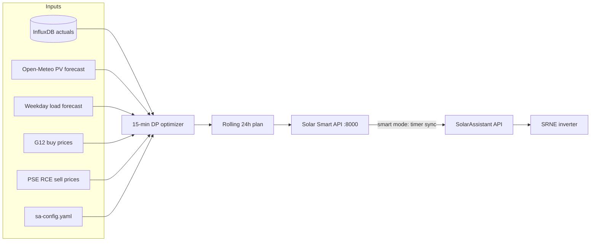

# Solar Smart — energy arbitrage for SRNE via SolarAssistant

**Solar Smart** is a Raspberry Pi web app for **energy arbitrage** planning and optional automation of an **SRNE** hybrid inverter through the [SolarAssistant](https://solarassistant.com/) REST API. It reads live metrics and InfluxDB history, runs a 15-minute **optimizer**, and — when Smart mode is on — **updates the inverter timer schedule** through SolarAssistant each hour.

Runs alongside SolarAssistant (port **80**) on port **8000**. Tested with **SRNE 3-phase** and a **G12** two-zone buy tariff (Poland).

**topics:** `srne` `solarassistant` `energy-arbitrage` `inverter` `influxdb` `grafana` `home-assistant` `scheduler` `optimizer`

## Screenshots

| Dashboard — live PV / battery / grid flow | Rules — SRNE timer & inverter settings | Rules — rolling energy arbitrage plan |
|---|---|---|
|  |  |  |

## How it works



1. **Every hour at :00** the backend rebuilds a 24-hour plan (even when Smart mode is off).
2. The **optimizer** (`plan_optimizer.py`) minimises net electricity cost: `grid import × G12 buy − grid export × export credit`, with SOC floor and night reserve.
3. With **Smart mode** on, the next clock hour is translated into SA timer fields and pushed to SolarAssistant.
4. SolarAssistant applies the **Timer Schedule** on the SRNE.

## Features

- Live dashboard: PV, load, battery, grid, energy overview
- Hourly energy accruals and charts (InfluxDB)
- PV forecast (Open-Meteo) and RCE sell prices
- **Power Management** — scale PV and consumption forecast totals up to 2 days ahead; see [Power Management overrides](#power-management-overrides)
- **EV Charging** — plan day and night charge windows up to 2 days ahead; see [EV charging](#ev-charging)
- **Energy arbitrage simulation and monthly cost history** — rolling 24-hour plan that minimises your G12 electricity bill; hourly table with planned actions, import/export, and cash balance; closed-month totals from Influx actuals
- **Timer schedule read/write through SolarAssistant REST API** — view and edit SRNE timed charge/discharge slots in the UI; with Smart mode on, the backend updates the schedule automatically each hour

## Smart energy planning

Solar Smart does not talk to the inverter directly. It plans energy flows and, when enabled, programs the **Timer Schedule** that SolarAssistant already exposes for SRNE hybrid inverters.

### What the algorithm does

Every hour at **:00** the app rebuilds a **Plan Simulation** (this runs even when Smart mode is off):

1. **Inputs**

| Input | Source | Notes |
|-------|--------|-------|
| Live battery SOC | InfluxDB | Current state |
| Today's completed hours | InfluxDB | Measured PV, load, and grid flows |
| **PV forecast** | **Open-Meteo** | Weather-based generation; 2 days ahead; past hours use actuals |
| **Load forecast** | **Weekday load cache** | Typical consumption profile; 2 days ahead |
| G12 buy prices | Config | Peak / off-peak zones |
| PSE RCE sell prices | PSE API | Export credit |
| Battery & inverter limits | Config | Capacity, power limits, SOC floor, losses |

2. **Optimizer** — a 15-minute dynamic-programming model (`plan_optimizer.py`) steps through the next 24 hours and picks, for each quarter, whether to import from the grid, charge the battery from the grid, or export stored energy to the grid. The objective is to minimise net cash cost: `grid import × G12 buy − grid export × export credit`. Battery export is allowed only when RCE is high enough to beat keeping energy for self-consumption at off-peak buy price. A SOC floor (`min_soc_pct`) and night reserve prevent over-discharging before the next PV window.
3. **Output in the UI** — the **Energy arbitrage** tab shows the rolling plan hour by hour (action label, PV, load, grid flows, SOC, energy and service cost). Completed hours are reconciled against Influx actuals. **Monthly history** aggregates past days the same way.

### Power Management overrides

In the dashboard **Power Management** panel, scale PV and consumption forecast totals up to 2 days ahead relative to the baseline forecast. Changes are saved to config, applied to the day cache, and reflected in the energy arbitrage plan.

At **23:59** the nightly job clears these overrides so each day starts from fresh forecasts.

### EV charging

In the dashboard **EV Charging** panel, plan **day** and **night** charge windows (time range and power) up to 2 days ahead. Enabled windows add extra consumption to the load forecast and energy plan.

Past EV sessions are excluded when building the weekday load profile from historical data.

### How it controls the inverter

When Smart mode is on, the same hourly **:00** job extracts the **next clock hour** from the plan and writes it to SolarAssistant via REST:

| Planned action | Inverter effect |
|----------------|-----------------|
| **Charging from Grid** | Timed grid charge for the next hour |
| **Discharging to Grid and Load** | Timed discharge for the next hour |
| Other (idle, PV to load, discharge to load only) | Timed charge/discharge cleared |

Use **Sync hour** in the Rules tab to apply the plan immediately.

### What you get as a user

- **Visibility** — one place to see live status, buy vs sell prices (G12 + RCE chart), and a cost-aware plan for the next 2 days.
- **Optional automation** — toggle **Smart mode** in the Rules tab to let the Pi push the next-hour charge or discharge window without opening the SA UI each hour.
- **Accountability** — planned vs actual rows and monthly totals so you can see whether arbitrage decisions matched reality and what they cost.

**Energy arbitrage cost columns** (hourly plan and monthly history):

| Column | Meaning |
|--------|---------|
| **G12 zone / buy price** | Peak or off-peak zone and full G12 buy rate (PLN/kWh brutto) for that hour |
| **RCE price** | PSE day-ahead price used as export credit under net-billing |
| **Energy Cost** | Net **energy (obrót)** balance: import at the G12 energy component minus export credited at RCE (PV and battery export priced separately). Positive cash flow in the UI = export credit exceeds energy import. |
| **Service Cost** | **Distribution and other non-energy fees** on grid import — the part of G12 brutto above the energy component (dystrybucja, opłaty sieciowe and similar per-kWh charges in the Energa tariff). Charged only on imported kWh; not offset by export. |

For each imported kWh, G12 brutto splits into an **energy** share (`peak_energy_only_pln_kwh` / `offpeak_energy_only_pln_kwh` in config) and a **service** share (the remainder). Export settles against the energy side at RCE — the usual net-billing idea.

The optimizer shifts consumption, battery charge/discharge, and grid export to **improve the energy balance** (cheaper imports, exports when RCE is high) and **cut service cost** by reducing unnecessary grid import, especially in peak hours. **Monthly history** sums Energy Cost and Service Cost per day — together they estimate how the plan affects your monthly Energa invoice.

Smart mode is **off by default**; the plan table and charts work without writing anything to the inverter.

## Minimal configuration

Copy `sa-config.yaml.example` to `sa-config.yaml` and set at least site location, battery size, SA password, and G12 prices:

```yaml
location:
  latitude: 52.0
  longitude: 21.0

solar:
  azimuth: 180
  blocks:
    - { power_kwp: 5.0, tilt: 30 }

inverter:
  ac_capacity_kw: 5.0

battery:
  capacity_kwh: 10.0
  max_charge_power_kw: 5.0      # SA timer charge power (kW DC)
  max_discharge_power_kw: 5.0   # SA timer discharge power (kW DC)

simulation:
  min_soc_pct: 15

grid:
  g12:
    tariff_name: "G12"
    peak_price_pln_kwh: 1.0
    offpeak_price_pln_kwh: 0.5

sa:
  host: "localhost"
  password: "YOUR_SA_WEB_PASSWORD"
```

See `sa-config.yaml.example` for EV charging, loss factors, load profile, and SA metric topic overrides.

## Examples / Usage

### 1. Install on Pi and open the UI

```bash
git clone <repository-url>
cd solar-assistant
cp sa-config.yaml.example sa-config.yaml
# edit sa-config.yaml — sa.password and your site
bash install.sh
```

Open `http://<pi-ip>:8000/rules` — **Energy arbitrage** shows the plan; **Timer Schedule** mirrors what SolarAssistant reports.

### 2. Enable Smart mode

**UI:** Rules → Timer Schedule → toggle **Smart mode**.

**API:**

```bash
curl -X POST http://<pi-ip>:8000/api/smart-mode \
  -H "Content-Type: application/json" \
  -d '{"enabled": true}'
```

On enable, Solar Smart runs an immediate sync. Thereafter the hourly **:00** job updates the timer schedule.

## Requirements

- Raspberry Pi with SolarAssistant installed (InfluxDB on `localhost:8086`)
- Python 3.11+ (3.12 recommended)
- SRNE inverter exposed through SolarAssistant discovery API
- SA web password configured (Configuration → Security)

## Service management (Pi)

Solar Smart: `http://<pi-ip>:8000/`

Service management:

```bash
sudo systemctl status smart
bash scripts/reload-smart.sh
```

## Deploy updates from Windows

```powershell
.\sync-to-pi.ps1
```

`sa-config.yaml` on the Pi is **not** overwritten by deploy (local site config).

## Local development (Windows)

```powershell
py -m venv .venv
.\.venv\Scripts\pip install -r requirements.txt
copy sa-config.yaml.example sa-config.yaml
copy sa-config.local.yaml.example sa-config.local.yaml
# Edit sa-config.yaml (same as Pi) and sa.password; local overlay sets sa.host to Pi IP

.\scripts\run-local.ps1
```

Uses `sa-config.yaml` plus optional `sa-config.local.yaml` overlay, SSH tunnel to Pi InfluxDB. Open `http://127.0.0.1:8000/`.

## Configuration

| File | Purpose |
|------|---------|
| `sa-config.yaml` | Main site config (gitignored; same file on Pi and Windows) |
| `sa-config.yaml.example` | Template for new installs |
| `sa-config.local.yaml` | Optional Windows overlay merged at load (gitignored; e.g. `sa.host`) |

Key flags in config:

- `debug_tab_enabled` — show Debug tab in UI

## License

MIT — see [LICENSE](LICENSE).
