# Energy Arbitrage — архитектурная схема

> **Просмотр диаграмм**
> - **Браузер (рекомендуется):** откройте [`energy-arbitrage-architecture.html`](energy-arbitrage-architecture.html) в Chrome/Edge (двойной клик или drag-and-drop). После правок MD: `python scripts/build-architecture-html.py`.
> - **Cursor preview MD:** `Ctrl+Shift+V` + расширение **Markdown Preview Mermaid Support** (`bierner.markdown-mermaid`) + Reload Window. В workspace включено `"markdown.mermaid.enabled": true`.

Документ описывает логику вкладки **Energy arbitrage**: pipeline симуляции, классификацию часов, unified q15 sim chain и карты состояний.

Ключевые модули: `plan_simulation.py`, `simulation.py`, `plan_hourly_actuals.py`, `plan_optimizer.py`, `forecast_cache.py`.

---

## 1. Контекст и границы системы

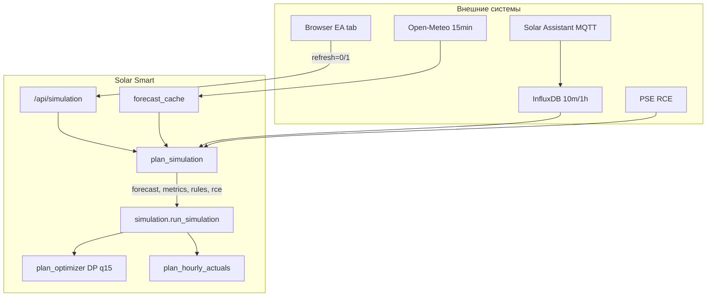

**Ответственность слоёв:**

| Слой | Роль |
|------|------|
| `plan_simulation` | Оркестрация, in-memory cache, триггеры (:00/:15/:30/:45) |
| `simulation` | Сборка horizon rows, связка optimizer + blend + replay |
| `plan_optimizer` | DP по q15: grid charge / battery export, минимум G12 cost |
| `plan_hourly_actuals` | Факты, blend текущего часа, physics sim, forward replay |
| `forecast_cache` | File cache PV/Load, Open-Meteo refresh, overrides |

---

## 2. Главный pipeline (end-to-end)

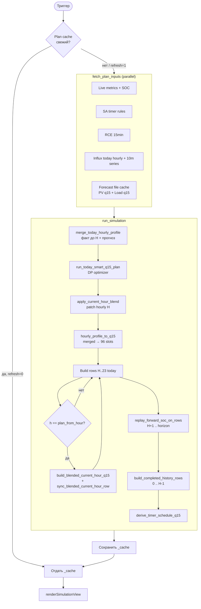

**Триггеры пересчёта:**

- Scheduler каждые 15 мин (`:00/:15/:30/:45`)
- UI: кнопка Refresh → `GET /api/simulation?refresh=1`
- Config/EV change → `invalidate_plan_cache` + `force_refresh`

---

## 3. Классификация часов (temporal model)

Horizon = `plan_from_hour` (текущий час `:00`) + `horizon_hours` (обычно 24–48).

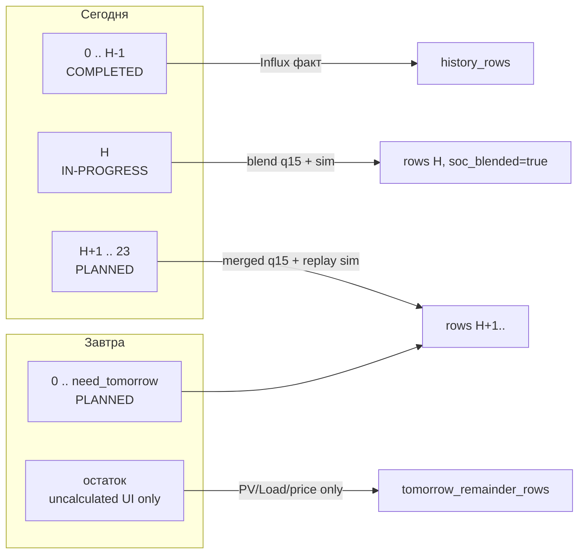

| Сегмент | PV/Load | Battery/Grid/SOC | Optimizer controls |
|---------|---------|------------------|-------------------|
| **Past** `0..H-1` | Influx hourly | Influx факт | Retro timer schedule |
| **Current** `H` | Per-q15 blend (10m + OM q15) | `simulate_blended_current_hour_q15` | DP slots + sim physics |
| **Future today/tomorrow** | merged hourly ÷ 4 | `replay_forward_soc` | DP slots + sim physics |
| **Tomorrow remainder** | forecast hourly | `null` (нет sim) | — |

---

## 4. Unified sim chain (ядро EA)

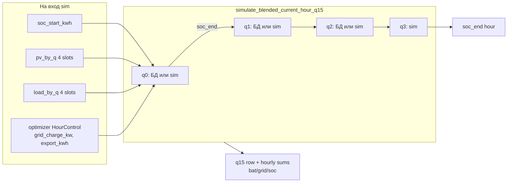

**Anchor SOC текущего часа:** end of hour `H-1` из Influx (`_plan_start_soc_kwh`), не live MQTT SOC.

**Anchor для future replay:** end SOC blended current hour (`blended_anchor_kwh`).

---

## 5. Blend текущего часа — dataflow

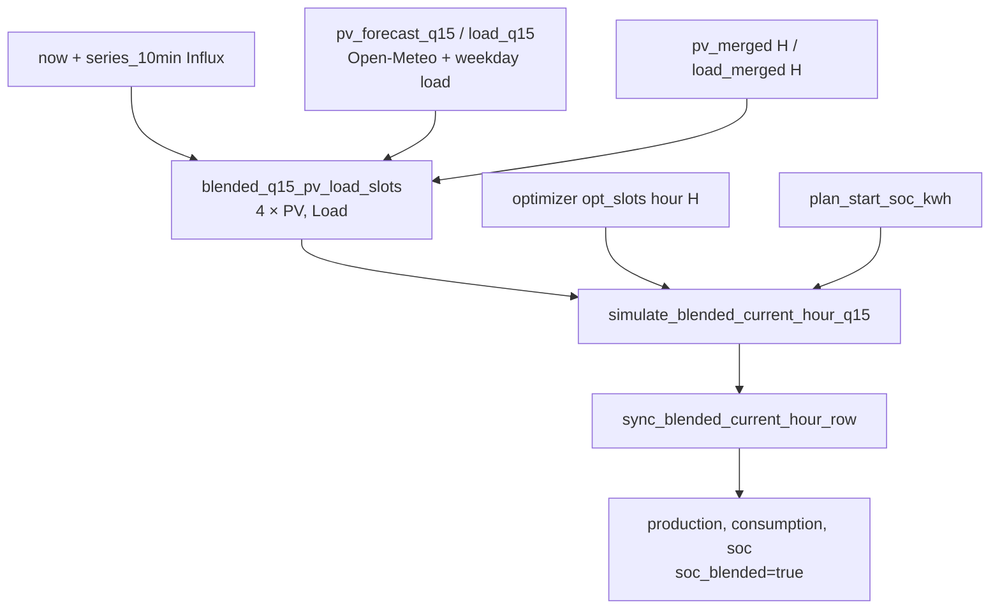

Обновление на каждом refresh `:00/:15/:30/:45` (текущий час **H**).  
Индексы **q0–q3** = четверти `:15`, `:30`, `:45`, `:00` (конец часа).  
**frozen** = значение не пересчитывается (детерминировано из БД на прошлом refresh).  
**прогноз** = Open-Meteo q15 (load — weekday profile).  
**БД** = Influx 10-min, те же окна, что и для PV blend.  
**sim** = `simulate_hour` по прогнозным PV/load + optimizer controls.

### PV / Load (q)

| Refresh | q0 (:15) | q1 (:30) | q2 (:45) | q3 (:00) |
|---------|----------|----------|----------|----------|
| **:00–:14** | прогноз | прогноз | прогноз | прогноз |
| **:15** | **БД** (10 мин × 1.5) | прогноз | прогноз | прогноз |
| **:30** | frozen | **БД** | прогноз | прогноз |
| **:45** | frozen | frozen | **БД** | прогноз |
| **:00** след. часа | — | — | — | час **H** → `history_rows` (полный факт) |

### Battery / Grid (n)

`battery` = charge − discharge; `grid_import` / `grid_export` — из тех же q15-окон Influx.

| Refresh | q0 | q1 | q2 | q3 |
|---------|----|----|----|-----|
| **:00–:14** | sim | sim | sim | sim |
| **:15** | **БД** | sim | sim | sim |
| **:30** | frozen | **БД** | sim | sim |
| **:45** | frozen | frozen | **БД** | sim |
| **:00** след. часа | — | — | — | час **H** → `history_rows` |

### SOC (m)

Якорь: **SOC конца часа H−1** из Influx (`plan_start_soc_kwh`).  
На **БД-слотах**: `soc += battery_delta` (факт из Influx).  
На **sim-слотах**: `soc_end` из `simulate_hour` (physics + optimizer).

| Refresh | m0 (SOC @ :15) | m1 (@ :30) | m2 (@ :45) | m3 (@ :00) |
|---------|----------------|------------|------------|------------|
| **:00–:14** | sim(q0) | sim(q1) | sim(q2) | sim(q3) |
| **:15** | anchor + **Δ БД q0** | sim(q1) | sim(q2) | sim(q3) |
| **:30** | frozen | m0 + **Δ БД q1** | sim(q2) | sim(q3) |
| **:45** | frozen | frozen | m1 + **Δ БД q2** | sim(q3) |
| **:00** след. часа | — | — | — | час **H** → факт Influx |

### Будущие часы (H+1 … horizon)

| | PV / Load | Battery / Grid | SOC |
|---|-----------|----------------|-----|
| Все q15 | merged hourly ÷ 4 | **sim** (прогноз) | цепочка от `blended_anchor_kwh` |

Функция: `replay_forward_soc_on_rows` → `simulate_q15_slots` (без blend, без Influx).

---

## 6. Optimizer vs Physics (разделение ответственности)

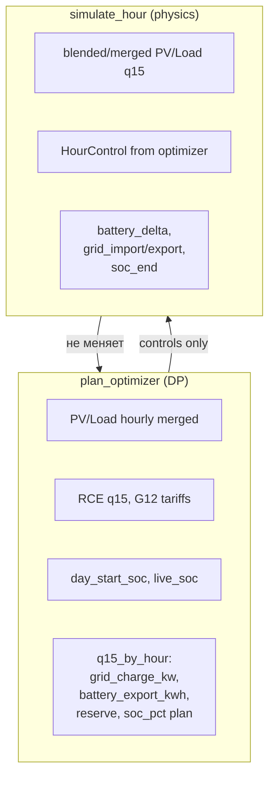

Optimizer решает **что делать** (charge/export). Physics считает **что получится** (SOC, сети, потери η).

---

# Карты состояний

## A. Состояние plan cache

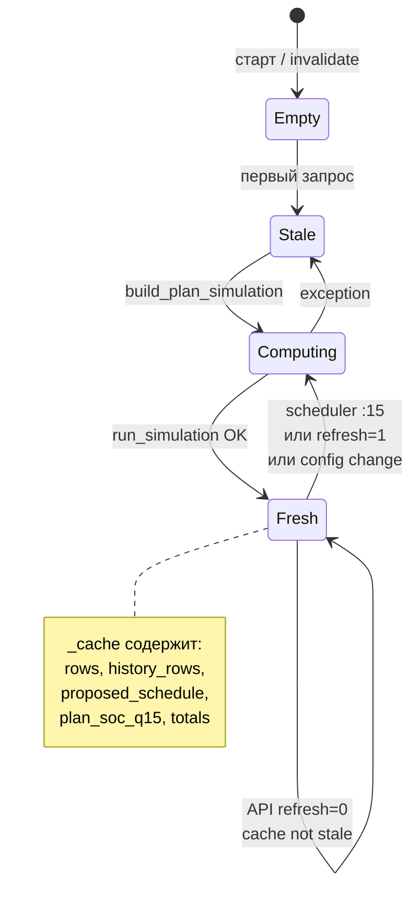

---

## B. Состояние часовой строки (row lifecycle)

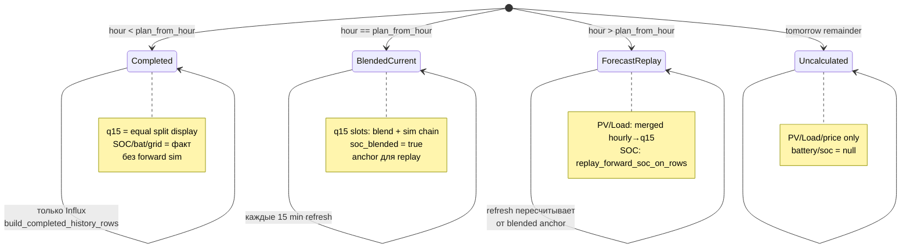

---

## C. Q15-слот текущего часа (blend FSM)

Зависит от `(now.minute, now.hour == H)`:

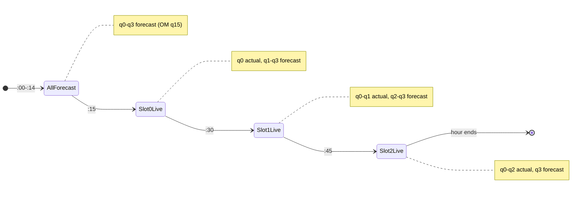

| `refresh_idx` | Frozen (actual) | Tail (forecast) |
|---------------|-----------------|-----------------|
| -1 (:00–:14) | — | q0–q3 |
| 0 (:15–:29) | q0 | q1–q3 |
| 1 (:30–:44) | q0–q1 | q2–q3 |
| 2 (:45–:59) | q0–q2 | q3 |

---

## D. Источник SOC для отображения

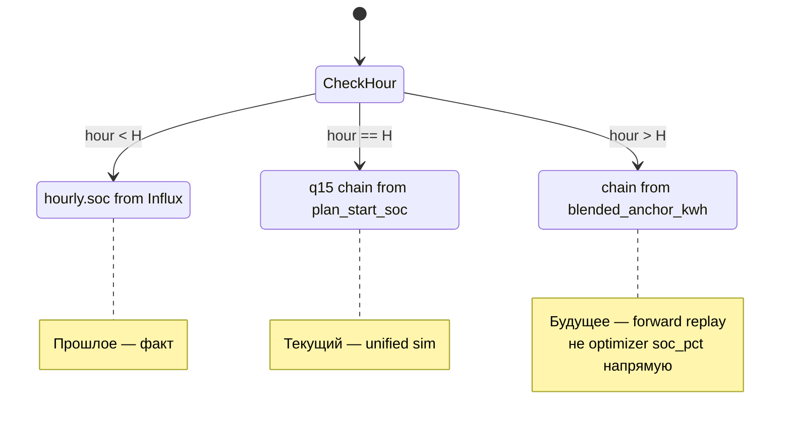

---

## E. Open-Meteo PV cache

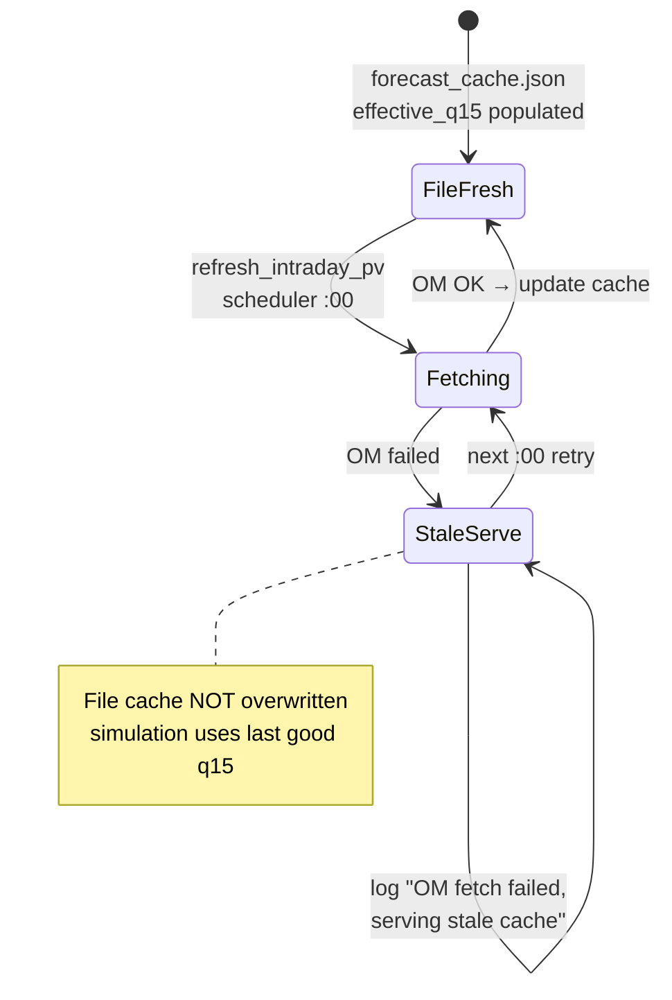

---

## F. Smart Mode × Scheduler (побочный контур)

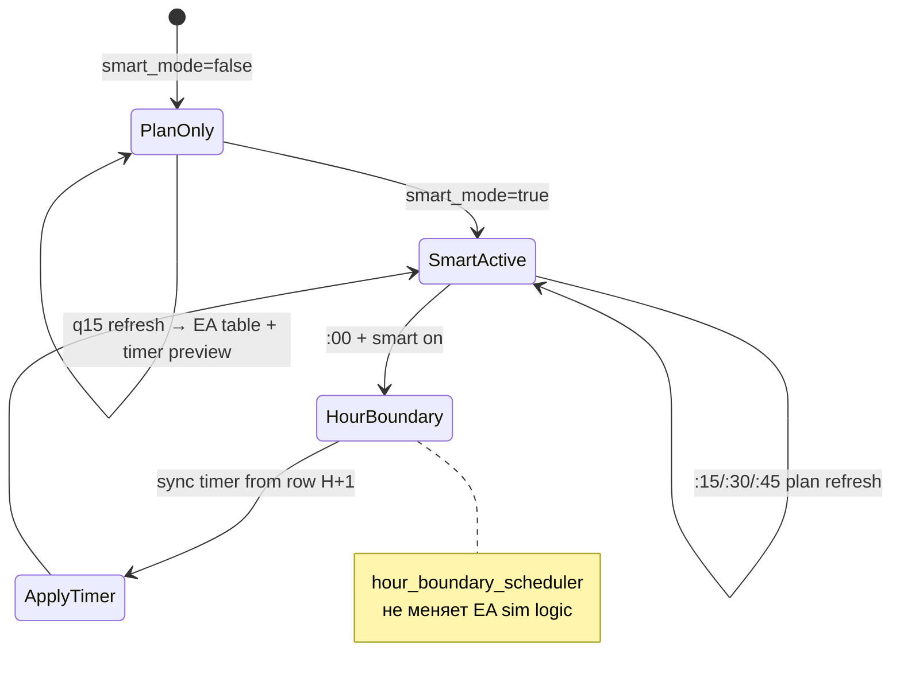

---

## 7. Выход API → UI

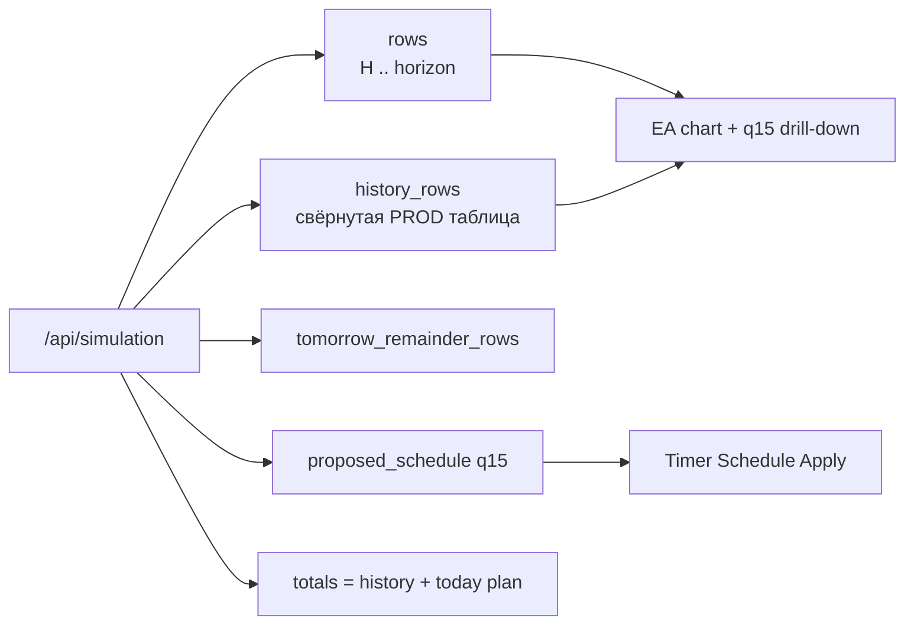

---

## Ключевые инварианты

1. **Один physics engine** — `simulate_blended_current_hour_q15` (текущий час) и `simulate_q15_slots` (future replay); past — Influx.
2. **Optimizer отделён от display SOC** — future SOC идёт через replay, не через «rebase» optimizer SOC.
3. **Merged hourly — источник для future q15** — `hourly_profile_to_q15`, не сырой OM q15 в replay.
4. **Current hour — исключение** — per-slot blend (10m + OM q15) для точности внутри часа.
5. **Plan cache in-memory** — UI читает snapshot; Refresh = полный recompute pipeline.

---

## Связанные файлы

| Файл | Назначение |
|------|------------|
| `src/plan_simulation.py` | Cache, `build_plan_simulation`, scheduler hook |
| `src/simulation.py` | `run_simulation`, сборка rows |
| `src/plan_hourly_actuals.py` | Blend, sim chain, replay, history |
| `src/plan_optimizer.py` | DP q15 optimizer |
| `src/forecast_cache.py` | File cache, OM refresh, load profile |
| `src/routes/data.py` | `GET /api/simulation` |
| `src/templates/index.html` | EA UI, Refresh, charts |
